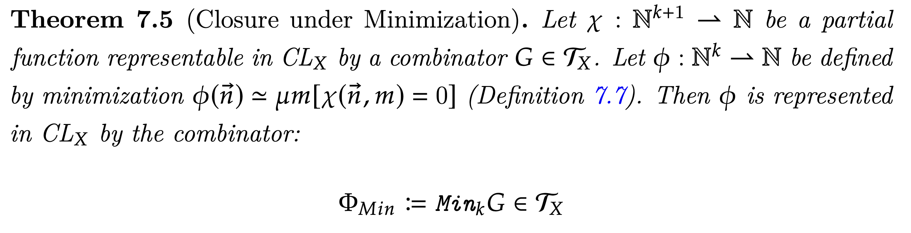
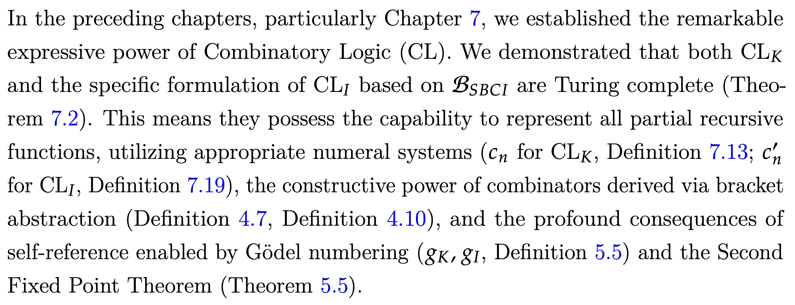

# HiRAG: Retrieval-Augmented Generation with Hierarchical Knowledge

This repo is *not* the official repo for HiRAG. The idea, the concept, the main mechanism, all belong to [@hhy-huang](https://github.com/hhy-huang). You can find the original repo [here](https://github.com/hhy-huang/HiRAG), and the paper [here](https://arxiv.org/pdf/2503.10150).

You can find the original readme file [here](readme.hhy-huang.md).

## What this repo changes

The main purpose of the fork is to specialize HiRAG for academic– specifically math knowledge. To do that, I've changed the prompts extensively. Most knowledge graph extraction libraries don't work for such purposes because the LLMs tend to extract information in the worst way possible. Let me explain by a few examples:

A general purpose Graph RAG / HiRAG will extract entities such as $\chi$, $G \in \mathcal{T}_X$, $\phi$, and so on.
The problem with this is that none of these "entities" should be in the graph. They are merely constructed for the sake of the argument and never used again. A mathematically aware LLM will notice this and won't extract them.

The purpose is to extract the *facts* that matter, that are *permanent* in the sense that they are valid outside their local context. Another example is:

A general purpose HiRAG would extract almost *all statements* from here, such as "Chapter 7", "Definition 7.13", and so on. It's not hard to see why this is a problem.
Again, my implementation will instruct the LLM to completely ignore these, only extracting entities such as $\mathcal{B}_{SBCI}$, "Turing Completeness", and so on.

## Other improvements

Aside from specializing it for mathematical/academical purposes, I have also made a few general improvements.

### Disambugiation

The original extraction pipeline would look for entities with identical names and merge them in an LLM-assisted manner. This approach is naive because it assumes that different passes would extract the same entity with the *exact same name*. Even if you set the LLM temperature to zero, since the context will change, you can not guarantee that one LLM would name an entity "Turing Completeness", while the other names it "The Turing Completeness Property", while the other names it "Turing Complete". Therefore, I added one extra step to the pipeline, where we perform both semantic and lexical analysis of the entity names, decide on candidates that may refer to the same entity, and ask an LLM to decide whether they refer to the same entity or not. For entities deemed the same, we assign them the same name before proceeding. Then, the same process of merging and the rest proceeds as before.

### Ingestion resillience

The ingestion now includes:

- Token estimation: The codebase estimates how much input/output tokens will be spent per entity. This includes learnable parameters, so the estimation accuracy will improve over time.
- Token tracking: It will track the actual tokens spent.
- Rate limiting: The ingestion pipeline will adhere to rate limiting parameters. For example, if there's a 10 RPM rate limit, it will wait after making 10 requests. Similarly, it will adhere to token limitations and other limitations.
- Progress tracking: Aside from logs, there is a central dashboard to track the progress of ingestion now.
- Validation, configuration, error handling: General improvements made. A central configuration exists now for detailed parameters about document ingestion.

## Note

The codebase is a work-in-progress as of Jul 26, 2025. This section will be removed when it is production-ready.